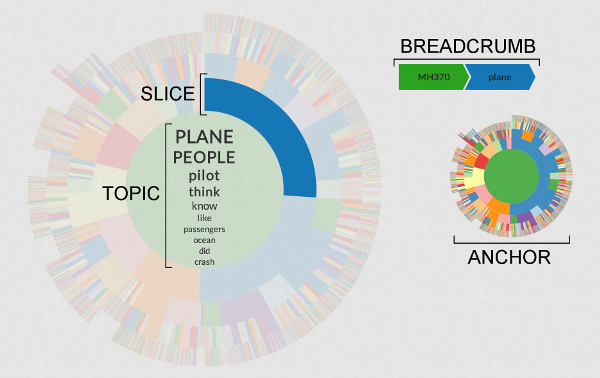

# Visualization
This visualization is an angularJS application. 
The main data files (json files) can be found inside app/data. We can replace those file to create visualizations for different data.

A live demo of this visualization can be seen [here](http://asutosh-satapathy.com/#/)

#Hierarchie

Hierarchie provides hierarchical navigation of the different topics or themes from text. These topics are discovered using a technique called Hierarchical Latent Dirichlet Allocation (HLDA), and are represented in the visualization as lists of words.

Hierarchie was created by the data visualization team for [DECISIVE ANALYTICS Corporation](http://www.dac.us). This implementation of a sunburst was based upon [Sequences Sunburst](http://bl.ocks.org/kerryrodden/7090426) by Kerry Rodden and [Zoomable Sunburst](http://bl.ocks.org/mbostock/4348373) by Mike Bostock.

### Interactivity

Hierarchie updates on mouseover and zooms on click, so it's best viewed on a laptop or desktop. 

### Known Issues & Suggested Improvements
- Exposing the documents underlying topics
- Search capabilities
- Improving responsiveness of website and visualizations
- Better cross-browser support (Center text appends using foreignObject will not work in IE)
- Needs tests!

### License

Hierarchie is covered by the Apache Version 2.0 License. Please see LICENSE.txt for more details.
